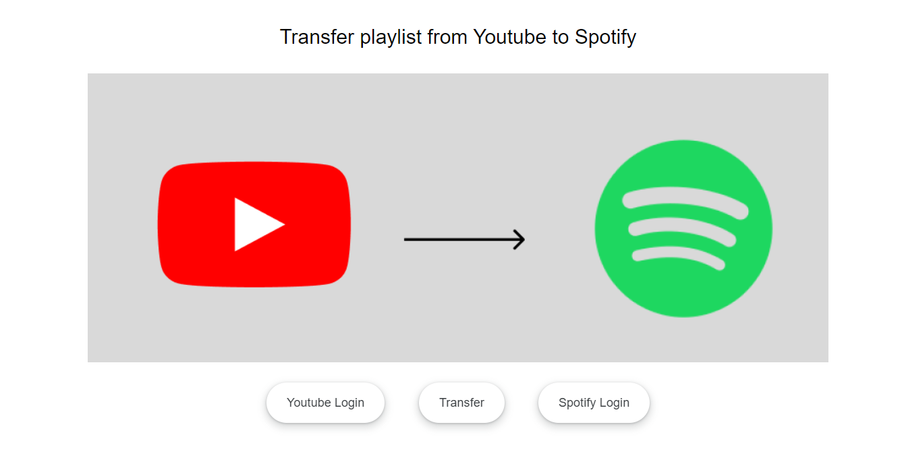

# Youtube to Spotify Playlist Transfer

This project contains the source code for the music project that transfer playlist/songs from youtube to spotify.

## Apps
The project contains two node apps, one is node backend server, `server`, that handles login and obtaining youtube tokens and spotify tokens using Oauth. The second is the `you-tify` React client app that uses the obtained tokens to make direct calls to the Spotify and Youtube API. 

## Working 
The app uses the youtube api to fetch the playlist available in the youtube account.When playlist has been selected , it collects the list of music available in the playlist and its details.The details is then used to search for the respective songs in the spotify which is then utilized to create a new playlist or transfer them to the present playlist in spotify.

## Setting up the Developer Accounts
In order to use the app , developer accounts for spotify and youtube is required.Both are free to use for testing.

### Spotify Developer Account Setup
To sign up for a developer account use this link: https://developer.spotify.com/ .
Or 
Follow the instruction in : https://developer.spotify.com/documentation/web-api

### Youtube Developer Account Setup
To sign up for developer account use this link: https://console.developers.google.com/
Or 
Follow the instruction in : https://developers.google.com/youtube/v3/getting-started

## Instructions:
To run the webapp locally, you will need a Spotify developer account and Youtube developer account. The
setup for both accounts is mentioned above.

1. Clone the repo

2. Get API key and client secret from both developer account.

3. `cd server` and create a env file with following fields as 
    PORT = 5000
    GOOGLE_CLIENT_ID = 
    GOOGLE_CLIENT_SECRET =
    SPOTIFY_CLIENT_ID = 
    SPOTIFY_CLIENT_SECRET = 
  Use the keys obtained from each sites.

4. `cd server` and Run `npm install`, then start the server using `npm start`. 

5. `cd you-tify` and  Run `npm install` then `npm start` to start the react app. 

6. Login into both of the accounts and use the app to transfer the music 

## Future Improvements 
It needs better UI/UX layout.
It needs better security with token handling and usage before pushing into development.
More Improvements .....

